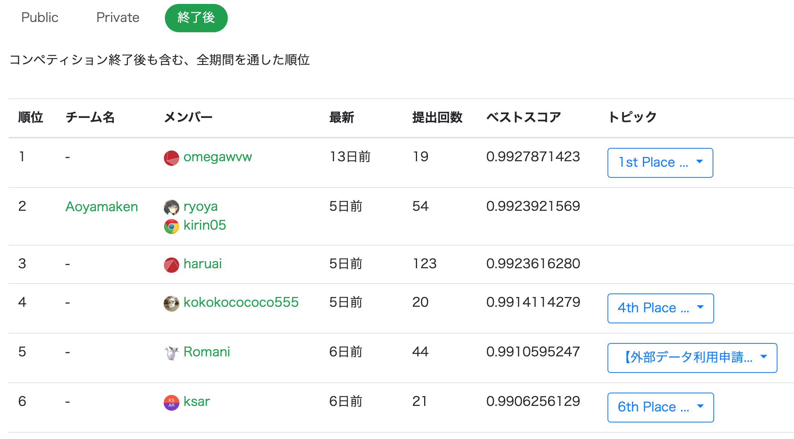

# ProbSpace スパムメール判別 6th Place Solution
- https://prob.space/competitions/spam_mail

## pre-process
- メール内の一番最初の改行コードを[SEP]に置換
  - メールのタイトルと本文をBERTに区別して入力
  - 文頭の"Subject: "は除去しなかった

## modeling
- Stratified 5-Fold
- models
  - BERT
  - RoBERTa
  - Electra
  - 上記3つの出力の平均をとってアンサンブル
- 各層の[CLS]のhidden stateの重み付き平均を出力
  - 重みが合計1になるように制約をかけて，訓練可能なパラメータとした
  - Google QUEST Q&A Labeling 1st place より
    - https://www.kaggle.com/c/google-quest-challenge/discussion/129840
- 各層ごとにlearning rateを設定
  - 出力から遠い層ほど小さくなるように設定
  - How to Fine-Tune BERT for Text Classification? より
    - https://arxiv.org/abs/1905.05583
- multi-sample dropout
  - Multi-Sample Dropout for Accelerated Training and Better Generalization より
    - https://arxiv.org/abs/1905.09788
- cosine\_schedul\_with\_warmup

## post-process
- 出力結果が7838:17000になるように最適化
  - SIGNATE Sutudent Cup 2020 より
    - https://signate.jp/competitions/281/discussions/20200816040343-8180
- タイトル，本文ともにnullであるメール（'Subject: \r\n'）を0と予測

## what did not work
- 本文中に多く登場した'enron', 'ect', 'hou'をtokenizerの辞書に追加
- XLNet
  - もっとしっかりチューニングをすれば効果的だったかもしれない

## result
### Public Score
- 5位

### Private score
- 6位

